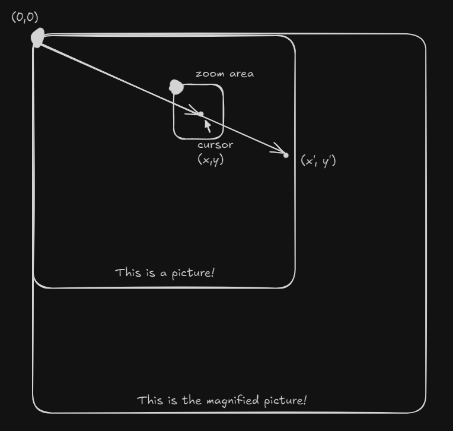
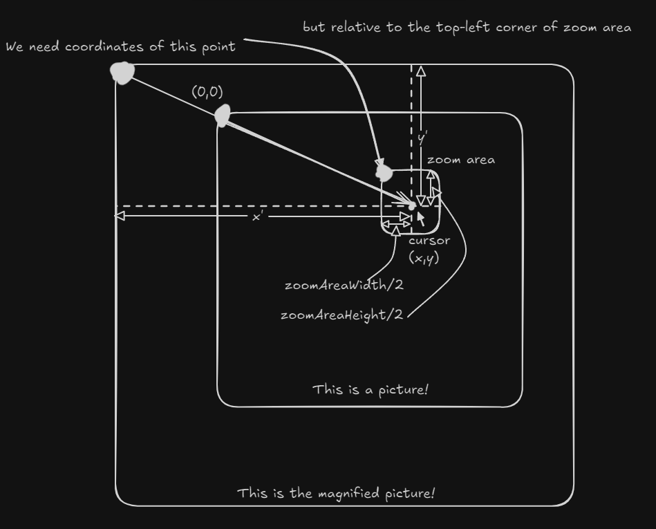

# 图片放大镜

这是一个使用纯 JavaScript 和 CSS 的简单图片放大镜。

## 演示效果


## 使用方法

在浏览器中打开 `index.html` 文件，然后将鼠标悬停在图片上即可放大。

## 工作原理

<!-- The most important part of this project is the JavaScript code that calculates the position of the magnified picture based on the position of the mouse over the image. -->
这个项目最重要的部分是 JavaScript 代码，它根据鼠标在图片上的位置计算放大图片的位置。

```javascript
const bgX = -(mouseX * scale - zoomAreaWidth / 2);
const bgY = -(mouseY * scale - zoomAreaHeight / 2);
```

这个式子计算了放大后的图像应当放置的位置。接下来我将解释这个式子是怎么得来的。

需要做的事是以指针为中心放大图像，所以需要为放大后的图像找到合适的放置位置。因为放大区域的背景图片是基于放大区域的左上角为原点，所以必须计算放大后的图像以放大区域左上角为零点的坐标。现在先以图片左上角为零点建立坐标系，而图像也基于左上角放大。假设$(x,y)$是指针的坐标，$(x^{'},y^{'})$是放大后图像中对应的指针位置，那么$x^{'}=scale\times x, y^{'}=scale\times y$。



<!-- Now move the magnified image so that the two points coincide. Remember that the coordinates of the top-left corner of the magnified image we want are relative to the coordinate system with the top-left corner of the zoom-area as the origin. -->
现在移动放大后的图像，使这两个点重合。要记得我们想要的放大图像的左上角的坐标是相对于以放大镜左上角为原点的坐标系的。



现在，容易注意到，放大图像的左上角的坐标是 $(-x^{'}+zoomAreaWidth/2, -y^{'}+zoomAreaHeight/2)$。

## 为什么有一张卡在转？

这是小夏，她很可爱。😊
