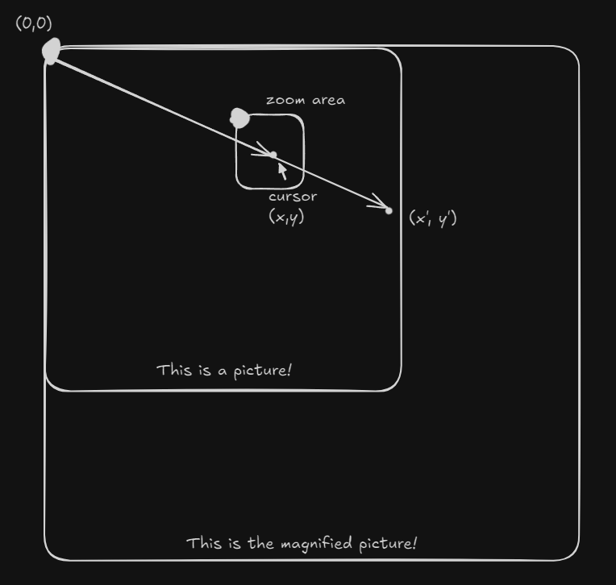
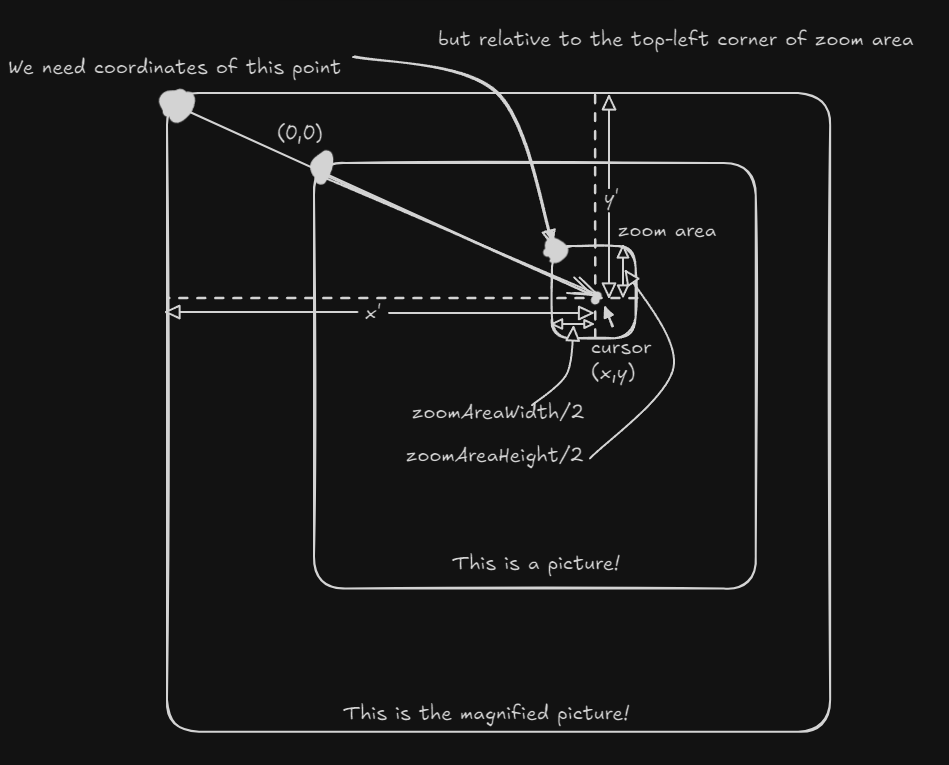

# Image Magnifier

[简体中文](readme-cn.md)

This is a simple image magnifier that uses pure JavaScript and CSS. 

## How it looks


## How to use

Just open the `index.html` file in your browser and hover over the image to magnify it.

## How it works

The most important part of this project is the JavaScript code that calculates the position of the magnified picture based on the position of the mouse over the image.

```javascript
const bgX = -(mouseX * scale - zoomAreaWidth / 2);
const bgY = -(mouseY * scale - zoomAreaHeight / 2);
```
<!-- 这个式子计算放大后的图像应当放置的位置。接下来我将解释这个式子的推理过程。 -->
This formula calculates the position where the magnified image should be placed. Next, I will explain the reasoning behind this formula.

<!-- 需要做的事是以指针为中心放大图像，所以需要为放大后的图像找到合适的放置位置。因为放大区域的背景图片是基于放大区域的左上角为原点，所以必须计算放大后的图像以放大区域左上角为零点的坐标。现在先以图片左上角为零点建立坐标系，而图像也基于左上角放大。假设(x,y)是指针的坐标，(x',y')是放大后图像中对应的指针位置，那么x'=scale*x, y'=scale*y。 -->
what we need to do is to magnify the image at the center of the cursor, so we need to find the right position of the magnified image. Because the background image of the zoom-area is based on the top-left corner of the zoom-area as the origin, we need to calculate the coordinates of the magnified image based on the top-left corner of the zoom-area. Now let's establish a coordinate system with the top-left corner of the image as the origin, and the image is also magnified based on the top-left corner. Suppose $(x,y)$ is the coordinate of the cursor, $(x^{'},y^{'})$ is the corresponding position of the cursor in the magnified image, then $x^{'}=scale\times x, y^{'}=scale\times y$.




Now move the magnified image so that the two points coincide. Remember that the coordinates of the top-left corner of the magnified image we want are relative to the coordinate system with the top-left corner of the zoom-area as the origin.



Now we can find that the coordinates of the magnified image's top-left corner is $(-x^{'}+zoomAreaWidth/2, -y^{'}+zoomAreaHeight/2)$.

<!-- 为什么网页里有一张旋转的卡片 -->
## Why is there a rotating card in the webpage?

Anyway, she's cute. 😊
